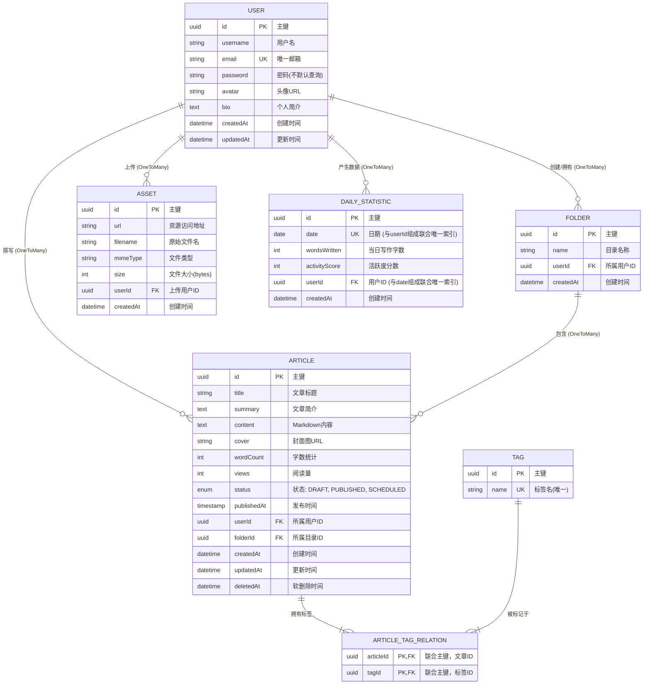

这是一个基于你提供的**后台笔记管理系统**功能需求设计的 TypeORM 实体（Entity）结构。

这些实体完美对应了前端页面的各个功能模块：文章管理、目录结构、发布配置、图片管理以及数据统计。

### 核心设计思路

1.  **UUID 主键**：使用 UUID 而非自增 ID，便于未来迁移或分布式扩展。
2.  **软删除**：引入 `@DeleteDateColumn`，防止手滑误删笔记。
3.  **读写分离设计**：将文章的“元数据”（标题、封面、状态）与“内容”（Markdown 大文本）虽然放在同一张表，但在查询列表时应避免加载 content 字段以提升性能。
4.  **统计优化**：设计了 `DailyStatistic` 表，专门用于生成“热力图”和“坚持天数”，避免每次都去全量扫描文章表。

---

### 1. User.ts (用户与个人中心)

对应“我的页面”，包含头像、邮箱、密码等信息。

```typescript
import {
  Entity,
  PrimaryGeneratedColumn,
  Column,
  CreateDateColumn,
  UpdateDateColumn,
  OneToMany,
} from "typeorm";
import { Article } from "./Article";
import { Folder } from "./Folder";
import { Asset } from "./Asset";

@Entity()
export class User {
  @PrimaryGeneratedColumn("uuid")
  id: string;

  @Column({ length: 50 })
  username: string;

  @Column({ unique: true })
  email: string;

  @Column({ select: false }) // 查询时不默认返回密码
  password: string;

  @Column({ nullable: true })
  avatar: string; // 头像URL

  @Column({ type: "text", nullable: true })
  bio: string; // 个人简介

  @OneToMany(() => Article, (article) => article.user)
  articles: Article[];

  @OneToMany(() => Folder, (folder) => folder.user)
  folders: Folder[];

  @OneToMany(() => Asset, (asset) => asset.user)
  assets: Asset[];

  @CreateDateColumn()
  createdAt: Date;

  @UpdateDateColumn()
  updatedAt: Date;
}
```

### 2. Folder.ts (目录结构)

对应“文章管理”左侧的文件夹列表。

```typescript
import {
  Entity,
  PrimaryGeneratedColumn,
  Column,
  ManyToOne,
  OneToMany,
  CreateDateColumn,
} from "typeorm";
import { User } from "./User";
import { Article } from "./Article";

@Entity()
export class Folder {
  @PrimaryGeneratedColumn("uuid")
  id: string;

  @Column()
  name: string;

  @ManyToOne(() => User, (user) => user.folders)
  user: User;

  @OneToMany(() => Article, (article) => article.folder)
  articles: Article[];

  // 如果需要无限层级目录，可以添加 parentId
  // @Column({ nullable: true })
  // parentId: string;

  @CreateDateColumn()
  createdAt: Date;
}
```

### 3. Article.ts (文章与发布管理)

核心实体。对应“文章管理（编辑器）”和“发布管理”。包含 Markdown 内容、状态、发布时间、封面等。

```typescript
import {
  Entity,
  PrimaryGeneratedColumn,
  Column,
  CreateDateColumn,
  UpdateDateColumn,
  DeleteDateColumn,
  ManyToOne,
  ManyToMany,
  JoinTable,
} from "typeorm";
import { User } from "./User";
import { Folder } from "./Folder";
import { Tag } from "./Tag";

export enum ArticleStatus {
  DRAFT = "draft", // 草稿
  PUBLISHED = "published", // 已发布
  SCHEDULED = "scheduled", // 定时发布
}

@Entity()
export class Article {
  @PrimaryGeneratedColumn("uuid")
  id: string;

  @Column()
  title: string;

  @Column({ type: "text", nullable: true })
  summary: string; // 文章简介

  // 使用 text 类型存储 Markdown 内容
  @Column({ type: "text" })
  content: string;

  @Column({ nullable: true })
  cover: string; // 文章封面图 URL

  // 统计字段：字数（每次保存时后端计算并更新）
  @Column({ default: 0 })
  wordCount: number;

  // 统计字段：阅读量
  @Column({ default: 0 })
  views: number;

  @Column({
    type: "enum",
    enum: ArticleStatus,
    default: ArticleStatus.DRAFT,
  })
  status: ArticleStatus;

  @Column({ type: "timestamp", nullable: true })
  publishedAt: Date; // 定时发布时间或实际发布时间

  @ManyToOne(() => User, (user) => user.articles)
  user: User;

  @ManyToOne(() => Folder, (folder) => folder.articles)
  folder: Folder;

  @ManyToMany(() => Tag, (tag) => tag.articles, { cascade: true })
  @JoinTable()
  tags: Tag[];

  @CreateDateColumn()
  createdAt: Date;

  @UpdateDateColumn()
  updatedAt: Date;

  @DeleteDateColumn()
  deletedAt: Date; // 软删除支持
}
```

### 4. Tag.ts (标签)

对应“发布管理”中的标签设置，以及“统计”页面的标签分布图。

```typescript
import { Entity, PrimaryGeneratedColumn, Column, ManyToMany } from "typeorm";
import { Article } from "./Article";

@Entity()
export class Tag {
  @PrimaryGeneratedColumn("uuid")
  id: string;

  @Column({ unique: true })
  name: string;

  @ManyToMany(() => Article, (article) => article.tags)
  articles: Article[];
}
```

### 5. Asset.ts (图片资源管理)

对应“图片管理”页面，用于管理上传的插图和封面。

```typescript
import {
  Entity,
  PrimaryGeneratedColumn,
  Column,
  CreateDateColumn,
  ManyToOne,
} from "typeorm";
import { User } from "./User";

@Entity()
export class Asset {
  @PrimaryGeneratedColumn("uuid")
  id: string;

  @Column()
  url: string; // 图片访问地址 (通常是 CDN 或 OSS 地址)

  @Column()
  filename: string; // 原始文件名

  @Column({ nullable: true })
  mimeType: string; // 例如 image/jpeg

  @Column({ nullable: true })
  size: number; // 文件大小 (bytes)

  @ManyToOne(() => User, (user) => user.assets)
  user: User;

  @CreateDateColumn()
  createdAt: Date;
}
```

### 6. DailyStatistic.ts (数据统计与热力图)

这是一个**特殊实体**，用于高效支持“统计”页面的需求（热力图、单日最多字数、坚持天数）。
_建议逻辑_：用户每天第一次保存或发布文章时，创建或更新当天的记录。

```typescript
import {
  Entity,
  PrimaryGeneratedColumn,
  Column,
  CreateDateColumn,
  ManyToOne,
  Index,
} from "typeorm";
import { User } from "./User";

@Entity()
@Index(["user", "date"], { unique: true }) // 确保每个用户每天只有一条记录
export class DailyStatistic {
  @PrimaryGeneratedColumn("uuid")
  id: string;

  @Column({ type: "date" })
  date: string; // 格式: '2023-10-24'

  @Column({ default: 0 })
  wordsWritten: number; // 当日新增/修改的字数（用于计算单日最多字数）

  @Column({ default: 0 })
  activityScore: number; // 活跃度分数 (用于生成热力图的深浅，比如每写100字+1分)

  @ManyToOne(() => User)
  user: User;

  @CreateDateColumn()
  createdAt: Date;
}
```

---

### 数据库关系图谱总结

1.  **User** 1 : N **Article**
2.  **User** 1 : N **Folder**
3.  **Folder** 1 : N **Article**
4.  **Article** N : N **Tag** (通过中间表)
5.  **User** 1 : N **Asset**
6.  **User** 1 : N **DailyStatistic**

### 针对前端统计图表的查询策略

1.  **笔记数**：`await articleRepository.count({ where: { user: { id: userId } } })`
2.  **总字数**：`await articleRepository.sum('wordCount', { user: { id: userId } })`
3.  **热力图**：查询 `DailyStatistic` 表，获取近一年的 `date` 和 `activityScore`。
4.  **笔记标签分布**：使用 QueryBuilder 对 `Tag` 进行聚合查询，计算每个 Tag 关联的 Article 数量。
5.  **单日最多字数**：查询 `DailyStatistic` 表中 `wordsWritten` 的最大值。

这套实体设计完全满足了你前端页面中所有的数据展示和交互需求，且具备良好的扩展性。


